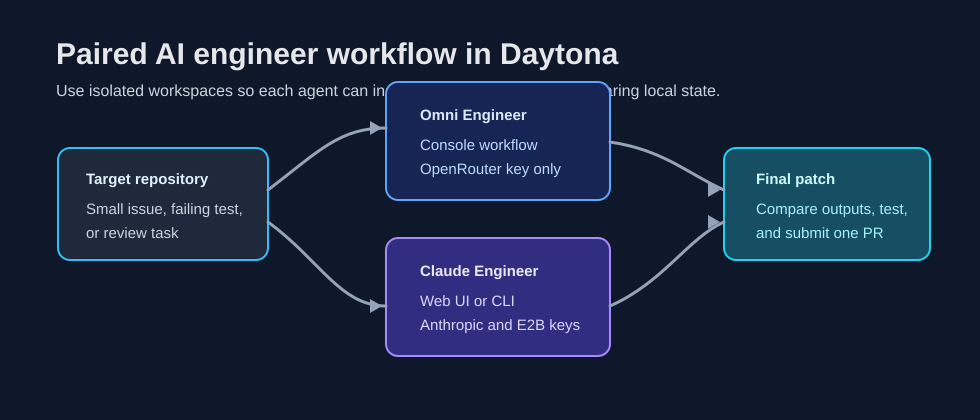

# Run Omni and Claude Engineers in Daytona

AI engineer tools are most useful when they can work inside the same kind of clean environment that a teammate would use. If the tool only runs on one laptop, the first debugging session often becomes about Python versions, missing packages, and misplaced API keys instead of the code task.

This article shows how to run [Omni Engineer](https://github.com/Doriandarko/omni-engineer) and [Claude Engineer](https://github.com/Doriandarko/claude-engineer) inside Daytona workspaces.
The workflow uses [development containers](/definitions/20240819_definition_development%20container.md) so each tool starts from a predictable Python image, installs its dependencies, and receives API keys from the workspace environment instead of from committed files.

Companion Dev Container pull requests were opened for both projects:

- [Omni Engineer devcontainer PR](https://github.com/Doriandarko/omni-engineer/pull/33)
- [Claude Engineer devcontainer PR](https://github.com/Doriandarko/claude-engineer/pull/257)

The example at the end uses the two agents as paired reviewers for one small repository task. Omni Engineer works from the terminal, Claude Engineer works from the web UI or CLI, and you keep the final decision in your own patch.



## TL;DR

- Add a `.devcontainer/devcontainer.json` to each AI engineer repository so Daytona can create a repeatable workspace.
- Store API keys in Daytona workspace environment variables, not in Git.
- Use Omni Engineer for fast terminal-driven repository inspection.
- Use Claude Engineer for a second pass with its web interface or CLI.
- Compare both outputs, run tests, and submit one human-reviewed patch.

## Prerequisites

Install Daytona locally and make sure you can create a workspace:

```bash
curl -L https://download.daytona.io/daytona/install.sh | sudo bash
daytona --version
```

You also need provider keys for the tools you plan to run:

- Omni Engineer uses `OPENROUTER_API_KEY`.
- Claude Engineer uses `ANTHROPIC_API_KEY`.
- Claude Engineer's E2B code execution tool uses `E2B_API_KEY` when that tool is enabled.

Do not paste real keys into a repository file. Add them as Daytona environment variables or export them in the workspace shell for the current session.

## What the Dev Containers Do

The Omni Engineer Dev Container uses the standard Python 3.11 devcontainer image, installs `requirements.txt`, copies `.env.example` to `.env` when a local file does not exist, and passes `OPENROUTER_API_KEY` from the host environment.

The Claude Engineer Dev Container uses the same Python base, installs the repository requirements, forwards port `5000` for the web UI, copies `.env.example` to `.env` when needed, and passes `ANTHROPIC_API_KEY` plus `E2B_API_KEY` from the host environment.

That gives both projects the same operational shape:

1. Daytona clones the repository.
2. The Dev Container installs Python dependencies.
3. Secrets come from environment variables.
4. You run the AI engineer from a clean shell.

## Create an Omni Engineer Workspace

Once the Omni Engineer Dev Container is available on the target branch, create a Daytona workspace from the repository:

```bash
daytona create https://github.com/Doriandarko/omni-engineer
daytona code
```

Inside the workspace, confirm the dependency install finished:

```bash
python -m pip show openai python-dotenv rich
```

Set the API key for the current shell if it is not already provided by your Daytona profile:

```bash
export OPENROUTER_API_KEY="your-openrouter-key"
```

Then start Omni Engineer:

```bash
python main.py
```

Omni Engineer is command driven. You can add files, ask questions, search, and request edits without leaving the terminal. A typical first session looks like this:

```text
/add README.md
/add src/example.py
Read these files and summarize the smallest safe change for the issue.
```

## Create a Claude Engineer Workspace

Create a second Daytona workspace for Claude Engineer:

```bash
daytona create https://github.com/Doriandarko/claude-engineer
daytona code
```

Set the keys for the current shell if Daytona did not inject them:

```bash
export ANTHROPIC_API_KEY="your-anthropic-key"
export E2B_API_KEY="your-e2b-key"
```

Run the web UI:

```bash
python app.py
```

Daytona should forward port `5000`. Open the forwarded URL and start a new conversation. If you prefer the terminal interface, run:

```bash
python ce3.py
```

Claude Engineer can inspect code, propose tools, and work through a longer implementation plan. I like using it as a second reviewer after Omni Engineer has produced a quick first-pass diagnosis.

## Example: Pair the Agents on One Small Task

For a concrete workflow, imagine a small repository that contains transcript files from product demos. The task is to normalize filenames, add a manifest, and keep the code easy to test.

Create a tiny target project in a separate Daytona workspace:

```bash
mkdir transcript-cleanup
cd transcript-cleanup
cat > normalize_names.py <<'PY'
from pathlib import Path


def normalize_name(path: Path) -> str:
    return path.stem.lower().replace(" ", "-") + path.suffix.lower()


if __name__ == "__main__":
    for item in Path("transcripts").glob("*"):
        print(normalize_name(item))
PY
mkdir transcripts
touch "transcripts/Product Demo.MD" "transcripts/Sprint Review.TXT"
```

Ask Omni Engineer for the first pass:

```text
/add normalize_names.py
The goal is to turn raw transcript filenames into safe lowercase slugs and generate a manifest.
Find edge cases and suggest a minimal tested patch.
```

Then ask Claude Engineer for an independent review:

```text
Review this small Python script as if it is going into a repository with tests.
Focus on filename collisions, deterministic output, and a simple manifest format.
Return a concise patch plan before writing code.
```

The useful part is not that both tools agree. The useful part is that they often disagree in visible ways:

- One may prioritize a simple `Path.rename` loop.
- One may notice collision handling.
- One may suggest JSON output while the other suggests CSV.
- One may ask for test fixtures before editing.

Use those differences to decide the final implementation. Keep the patch small, run the tests yourself, and only commit what you understand.

## Recommended Operating Pattern

Use separate workspaces for separate agents. That prevents one tool from silently inheriting another tool's temporary files, virtual environment, or failed dependency install.

Use environment variables for keys. If a tool expects `.env`, create it from the workspace shell and keep it untracked:

```bash
cp -n .env.example .env
printf 'OPENROUTER_API_KEY="%s"\n' "$OPENROUTER_API_KEY" > .env
```

For Claude Engineer, keep both keys explicit:

```bash
cp -n .env.example .env
{
  printf 'ANTHROPIC_API_KEY="%s"\n' "$ANTHROPIC_API_KEY"
  printf 'E2B_API_KEY="%s"\n' "$E2B_API_KEY"
} > .env
```

Use short prompts that describe the repository state and the acceptance criteria. Avoid asking either tool to "improve everything." A better prompt names the files, the bug, the constraints, and the verification command.

## Troubleshooting

If the workspace starts but the tool cannot authenticate, check the environment first:

```bash
env | grep -E 'OPENROUTER_API_KEY|ANTHROPIC_API_KEY|E2B_API_KEY'
```

If dependencies are missing, rerun the same install command from the Dev Container:

```bash
python -m pip install --user -r requirements.txt
```

If Claude Engineer's web UI does not open, confirm the server is listening on port `5000` and use Daytona's forwarded port URL:

```bash
python app.py
```

If an AI engineer produces a patch that looks plausible but untested, stop and add a narrow test before accepting the change. Daytona makes it cheap to start over, but it does not replace review.

## Why This Setup Works Well

Daytona gives both AI engineers the same basic contract: fresh repository, reproducible dependencies, isolated workspace, and explicit secrets. That makes the output easier to compare because the tools are not fighting the environment.

For day-to-day work, I would use Omni Engineer when I want a quick terminal-native pass and Claude Engineer when I want a longer structured review or web UI session. Running both in Daytona keeps the workflow disposable, repeatable, and easier to hand off to another developer.

## References

- [Omni Engineer](https://github.com/Doriandarko/omni-engineer)
- [Claude Engineer](https://github.com/Doriandarko/claude-engineer)
- [Daytona](https://github.com/daytonaio/daytona)
- [Development containers](/definitions/20240819_definition_development%20container.md)
