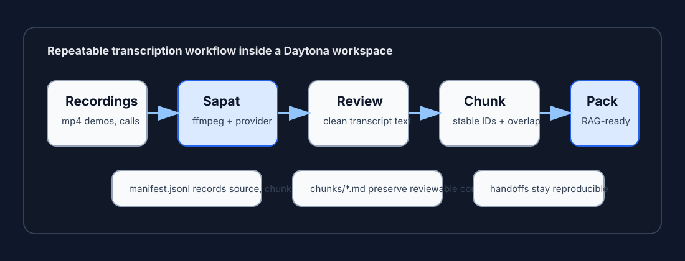

# Turn Sapat transcripts into AI memory packs

# Introduction

Most transcription workflows stop at a `.txt` file. That is useful for search,
but it is not enough when the recording needs to become durable engineering
context. A product demo, support call, research interview, or bug reproduction
video usually contains decisions, owners, feature names, timestamps, and
follow-up work. If all of that stays in one raw transcript, the next person or
AI assistant still has to rediscover the useful parts.

This guide shows how to use Daytona and [Sapat](https://github.com/nkkko/sapat)
to build a [transcript memory pack](../definitions/20260513_definition_transcript_memory_pack.md).
You will run Sapat in a reproducible Daytona workspace, generate transcripts
from videos, review the text, and convert the result into a folder of chunked
Markdown files plus a JSONL manifest. The final output is easier to feed into
retrieval systems, summarize for issue handoffs, or attach to internal
knowledge bases.



## TL;DR

- Daytona gives the transcription workflow a repeatable workspace with Python,
  `ffmpeg`, and provider credentials kept out of the repository.
- Sapat converts `.mp4` files to temporary MP3 files, sends them to OpenAI,
  Groq, or Azure OpenAI, and writes sidecar `.txt` transcripts.
- A memory pack adds structure after transcription: reviewed text, chunk files,
  source metadata, and a manifest that maps each chunk back to its recording.
- The pack can be reused by search, RAG pipelines, issue writers, release-note
  workflows, and internal support handoffs.

## Prerequisites

To follow this guide, you need:

- Daytona installed and signed in.
- Git and a terminal.
- Python 3.12 or a compatible Python 3 runtime.
- Access to one supported transcription provider: OpenAI, Groq, or Azure
  OpenAI.
- One short `.mp4` recording to test. A two-minute screen recording is enough.

The commands below use Groq as the example provider because Sapat exposes Groq,
OpenAI, and Azure OpenAI through the same CLI shape. Use whichever provider you
already have approved for your team.

## Step 1: Open Sapat in Daytona

Create a Daytona workspace from the Sapat repository:

```bash
daytona create https://github.com/nkkko/sapat --code
```

The repository already includes a dev container configuration. It uses the
Python 3.12 dev container image, installs the Python requirements, and installs
`ffmpeg` in `postCreateCommand`. That matters because Sapat always converts the
input video to MP3 before it calls the provider API.

If you want to work on your own fork instead, fork and clone first:

```bash
gh repo fork nkkko/sapat --clone
cd sapat
daytona create . --code
```

Use the forked route when you plan to change Sapat itself. Use the direct
workspace route when you only need a clean transcription environment.

## Step 2: Verify the Sapat CLI locally

Open the Daytona terminal and install Sapat from the checked-out source:

```bash
python -m venv .venv
source .venv/bin/activate
pip install -r requirements.txt
pip install -e .
```

Confirm the command is available:

```bash
sapat --help
```

Sapat accepts either a single video file or a directory. It processes `.mp4`
files, converts each file to `.mp3`, sends the MP3 to the selected provider, and
writes a `.txt` transcript next to the source video.

The important options are:

- `--api`: required provider selection. Current choices are `openai`, `groq`,
  and `azure`.
- `--quality`: MP3 conversion quality. Current choices are `L`, `M`, and `H`.
- `--language`: the expected audio language. The default is `en`.
- `--prompt`: optional vocabulary hints for the speech model.
- `--temperature`: sampling temperature for the provider request.
- `--correct`: sends the transcript through a chat model for cleanup.

For technical recordings, the `--prompt` flag is worth using. Add product
names, acronyms, speaker names, and unusual package names so the model has a
better chance of spelling them correctly.

## Step 3: Configure provider credentials

Copy the sample environment file:

```bash
cp .env.example .env
```

For Groq, set these values:

```bash
GROQCLOUD_API_KEY=your_groq_key
GROQCLOUD_MODEL=whisper-large-v3-turbo
GROQCLOUD_API_ENDPOINT=https://api.groq.com/openai/v1/audio/transcriptions
GROQCLOUD_MODEL_NAME_CHAT=llama3-8b-8192
```

For OpenAI, set these values:

```bash
OPENAI_API_KEY=your_openai_key
OPENAI_MODEL=whisper-1
OPENAI_API_ENDPOINT=https://api.openai.com/v1/audio/transcriptions
OPENAI_MODEL_NAME_CHAT=gpt-4o
```

For Azure OpenAI, set your resource endpoint and deployment names:

```bash
AZURE_OPENAI_API_KEY=your_azure_key
AZURE_OPENAI_ENDPOINT=https://your-resource.openai.azure.com
AZURE_OPENAI_DEPLOYMENT_NAME_WHISPER=whisper
AZURE_OPENAI_API_VERSION_WHISPER=2024-06-01
AZURE_OPENAI_DEPLOYMENT_NAME_CHAT=gpt-4o
AZURE_OPENAI_API_VERSION_CHAT=2023-03-15-preview
```

Do not commit `.env`. In a shared Daytona workflow, move these values into the
workspace secret store or your team's normal secret manager. The repository
should only contain `.env.example` and documentation.

## Step 4: Create a repeatable project layout

Create a folder layout that separates raw recordings from reviewed memory-pack
artifacts:

```bash
mkdir -p recordings
mkdir -p transcripts/raw
mkdir -p transcripts/reviewed
mkdir -p memory-pack/chunks
mkdir -p scripts
```

Put a short `.mp4` recording in `recordings/`. For example:

```text
recordings/
`-- sprint-review-demo.mp4
```

The exact recording is up to you. Good test files are product demos, customer
interviews, usability tests, code walkthroughs, and bug reproduction videos.
Start with a small clip so you can validate the whole workflow before you run a
large batch.

## Step 5: Transcribe one recording

Run Sapat against the file:

```bash
sapat recordings/sprint-review-demo.mp4 \
  --api groq \
  --quality M \
  --language en \
  --temperature 0.2 \
  --prompt "Daytona, Sapat, workspace, dev container, transcript memory pack"
```

When the command succeeds, Sapat writes:

```text
recordings/sprint-review-demo.txt
```

Move the sidecar transcript into the raw transcript folder:

```bash
mv recordings/sprint-review-demo.txt transcripts/raw/sprint-review-demo.txt
```

Open the file and do a light review pass. You do not need to rewrite the whole
transcript. Fix speaker names, product names, commands, timestamps, and any
sentence that would confuse someone using the text as evidence later.

Save the reviewed version:

```bash
cp transcripts/raw/sprint-review-demo.txt transcripts/reviewed/sprint-review-demo.txt
```

If you use Sapat's `--correct` flag, still review the result before building a
memory pack. Correction is another model call, not a substitute for checking
source-sensitive terms.

## Step 6: Add metadata for the recording

Create a metadata file next to the reviewed transcript:

```bash
cat > transcripts/reviewed/sprint-review-demo.metadata.json <<'JSON'
{
  "source_file": "recordings/sprint-review-demo.mp4",
  "transcript_file": "transcripts/reviewed/sprint-review-demo.txt",
  "title": "Sprint review demo",
  "recorded_at": "2026-05-13",
  "speakers": ["Host", "Engineer"],
  "tags": ["demo", "sprint-review", "daytona", "transcription"],
  "sensitivity": "internal",
  "review_status": "human-reviewed"
}
JSON
```

This file gives downstream tools stable context without asking them to infer it
from the transcript body. Keep the fields boring and explicit. The most useful
metadata usually includes the original file path, title, date, speakers, tags,
sensitivity, and review status.

## Step 7: Build chunk files and a manifest

Create `scripts/build_memory_pack.py`:

```python
from __future__ import annotations

import json
import re
from pathlib import Path

TRANSCRIPTS_DIR = Path("transcripts/reviewed")
OUTPUT_DIR = Path("memory-pack")
CHUNKS_DIR = OUTPUT_DIR / "chunks"
MANIFEST_PATH = OUTPUT_DIR / "manifest.jsonl"
WORDS_PER_CHUNK = 220
OVERLAP_WORDS = 35


def slugify(value: str) -> str:
    value = value.lower()
    value = re.sub(r"[^a-z0-9]+", "-", value)
    return value.strip("-")


def load_metadata(transcript_path: Path) -> dict:
    metadata_path = transcript_path.with_suffix(".metadata.json")
    if not metadata_path.exists():
        return {
            "source_file": "",
            "transcript_file": str(transcript_path),
            "title": transcript_path.stem.replace("-", " ").title(),
            "recorded_at": "",
            "speakers": [],
            "tags": [],
            "sensitivity": "unknown",
            "review_status": "unreviewed"
        }
    return json.loads(metadata_path.read_text(encoding="utf-8"))


def chunk_words(words: list[str]) -> list[list[str]]:
    chunks = []
    start = 0
    step = WORDS_PER_CHUNK - OVERLAP_WORDS
    while start < len(words):
        chunks.append(words[start:start + WORDS_PER_CHUNK])
        start += step
    return chunks


def main() -> None:
    CHUNKS_DIR.mkdir(parents=True, exist_ok=True)
    rows = []

    for transcript_path in sorted(TRANSCRIPTS_DIR.glob("*.txt")):
        text = transcript_path.read_text(encoding="utf-8").strip()
        if not text:
            continue

        metadata = load_metadata(transcript_path)
        words = text.split()
        title_slug = slugify(metadata["title"])

        for index, chunk in enumerate(chunk_words(words), start=1):
            chunk_id = f"{title_slug}-{index:03d}"
            chunk_path = CHUNKS_DIR / f"{chunk_id}.md"
            chunk_text = " ".join(chunk)

            chunk_path.write_text(
                "\n".join([
                    "---",
                    f"chunk_id: {chunk_id}",
                    f"title: {json.dumps(metadata['title'])}",
                    f"source_file: {json.dumps(metadata['source_file'])}",
                    f"transcript_file: {json.dumps(str(transcript_path))}",
                    f"review_status: {json.dumps(metadata['review_status'])}",
                    f"tags: {json.dumps(metadata['tags'])}",
                    "---",
                    "",
                    chunk_text,
                    ""
                ]),
                encoding="utf-8"
            )

            rows.append({
                "chunk_id": chunk_id,
                "chunk_path": str(chunk_path),
                "source_file": metadata["source_file"],
                "transcript_file": str(transcript_path),
                "title": metadata["title"],
                "recorded_at": metadata["recorded_at"],
                "speakers": metadata["speakers"],
                "tags": metadata["tags"],
                "sensitivity": metadata["sensitivity"],
                "review_status": metadata["review_status"],
                "word_count": len(chunk)
            })

    MANIFEST_PATH.write_text(
        "".join(json.dumps(row) + "\n" for row in rows),
        encoding="utf-8"
    )
    print(f"Wrote {len(rows)} chunks to {CHUNKS_DIR}")
    print(f"Wrote manifest to {MANIFEST_PATH}")


if __name__ == "__main__":
    main()
```

Run the script:

```bash
python scripts/build_memory_pack.py
```

The output looks like this:

```text
memory-pack/
|-- chunks/
|   |-- sprint-review-demo-001.md
|   |-- sprint-review-demo-002.md
|   `-- sprint-review-demo-003.md
`-- manifest.jsonl
```

Each chunk is plain Markdown with front matter. The manifest is newline-delimited
JSON so it is easy to stream into indexing jobs, spreadsheet checks, command-line
filters, or a custom ingestion script.

## Step 8: Add quality gates before ingestion

Before you use the pack in a search or AI workflow, run simple checks:

```bash
test -s memory-pack/manifest.jsonl
find memory-pack/chunks -name '*.md' -type f | wc -l
python -m json.tool transcripts/reviewed/sprint-review-demo.metadata.json >/dev/null
python - <<'PY'
from pathlib import Path
for path in Path("memory-pack/chunks").glob("*.md"):
    text = path.read_text(encoding="utf-8")
    if "TODO" in text or "UNKNOWN" in text:
        raise SystemExit(f"Review placeholder remains in {path}")
print("memory pack checks passed")
PY
```

These checks are intentionally small. They catch the common mistakes that make
transcript artifacts hard to reuse: empty manifests, missing chunks, invalid
metadata, and unresolved placeholders.

For a larger workflow, add more checks:

- Confirm that every `.txt` file has a matching `.metadata.json` file.
- Reject chunks above your retrieval system's preferred token budget.
- Require a `review_status` value of `human-reviewed` before ingestion.
- Keep sensitive recordings out of public indexes.
- Store the provider, model, and Sapat command used for each transcript.

## Step 9: Use the memory pack in downstream workflows

The memory pack can support several workflows without changing Sapat itself:

- **RAG ingestion**: Index `memory-pack/chunks/*.md` and store
  `manifest.jsonl` fields as metadata filters.
- **Issue handoffs**: Pull chunk IDs into bug reports so reviewers can trace a
  statement back to the recording.
- **Release notes**: Search transcript chunks for demoed features, decisions,
  and follow-up commitments.
- **Support knowledge base updates**: Convert reviewed answers from support
  calls into draft internal docs.
- **Engineering retrospectives**: Compare reviewed transcripts across sprint
  reviews and extract recurring blockers.

The main rule is to preserve traceability. If an AI-generated summary says a
customer asked for something, the memory pack should make it easy to find the
source transcript and chunk that support the claim.

## Troubleshooting

**Problem:** `ffmpeg` is not found.

**Solution:** Confirm the dev container has finished `postCreateCommand`. If it
has not, install `ffmpeg` manually with `sudo apt-get update && sudo apt-get
install -y ffmpeg`, then rebuild the workspace configuration later.

**Problem:** Sapat says the file is too large.

**Solution:** The OpenAI and Groq adapters in Sapat validate converted audio
against a 25 MB limit. Use `--quality L`, split the video into smaller clips, or
trim silent sections before transcription.

**Problem:** Product names are misspelled.

**Solution:** Use the `--prompt` option with a compact glossary. Include product
names, package names, CLI commands, and speaker names. Review the transcript
before chunking it.

**Problem:** Directory transcription skipped files.

**Solution:** Sapat currently scans directories for `.mp4` files. Convert or
rename other video formats before running a directory batch.

**Problem:** The memory pack has chunks but weak search results.

**Solution:** Add better metadata and reduce chunk size. Retrieval quality often
improves when chunks are smaller, tagged, and tied to explicit titles, speakers,
and source files.

## Conclusion

Sapat handles the transcription step, but Daytona makes the workflow repeatable
and safe for team use. By adding a reviewed transcript folder, metadata files,
chunked Markdown, and a JSONL manifest, you turn a one-off transcript into a
memory pack that downstream AI and engineering workflows can trust.

The next improvement is automation: commit the folder layout, the chunking
script, and the quality checks into the same repository as your recordings
workflow. Then each new demo, interview, or bug reproduction video can produce a
reviewable, retrieval-ready artifact with the same commands.

## References

- [Sapat repository](https://github.com/nkkko/sapat)
- [Daytona repository](https://github.com/daytonaio/daytona)
- [Daytona documentation](https://www.daytona.io/docs)
- [FFmpeg documentation](https://ffmpeg.org/documentation.html)
